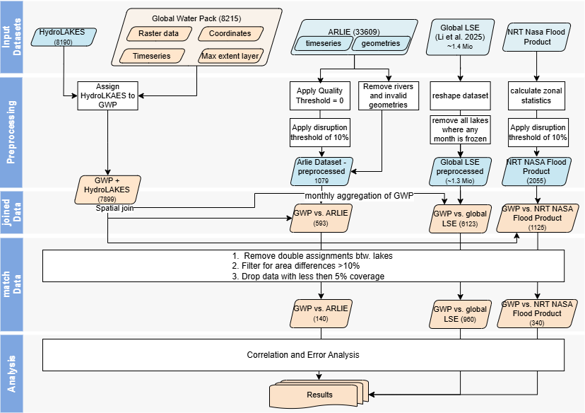

# Comparison of Global Water Pack with ARLIE, LSE and NRT-FP

# Get started
1. Go to GitHub and fork this repository.
2. Clone your fork to a directory of your choice: `git clone <the github url to your fork>`

This project is set up as a Python package. All commands below are run **from the repository root**, for example:

`uv run python scripts/01_run_hydrolakes_processing.py --config configs/europe_hydrolakes.json`

## Environment setup
This project uses two virtual environments: one managed via uv and one via pixi.

**uv environment:** used for nearly all scripts.

**pixi environment:** used only for the script that processes NASA Flood Product data, as it requires gdal.  restart your terminal after installing pixi

### uv Environment
1. If you don't have uv installed yet, follow the official guide: [uv installation guide](https://docs.astral.sh/uv/getting-started/installation/).

2. To set up the environment, run `uv sync` in your terminal.

3. Activation is only needed if you want to run scripts without the `uv run` prefix:

   ```
   source .venv/Scripts/activate  # Git Bash
   .venv\Scripts\Activate         # PowerShell
   .venv\Scripts\activate         # cmd
   ```

### pixi
1. If you don't have pixi installed yet, follow the official guide: [pixi installation guide](https://pixi.sh/dev/installation/)

2. To set up the environment, run `pixi install` in your terminal.

## About Paths
This code was developed on a Windows machine with Windows 11.

All configuration files in `configs/` use the same folder structure and share one root directory. Set the root in each config to your local data location:

```json
"root_dir": "PATH/TO/YOUR/DATA"
```

If you keep the folder layout described below, this is the only path you need to adjust.

Paths in this README are written with forward slashes, which work in PowerShell, cmd and Git Bash alike. In Git Bash, backslashes are interpreted as escape characters and will break the command.

**Storage note:** the complete input dataset is ~400 GB. An external drive is recommended. This repository contains code only; no data is included.

# Repository Structure
Each processing step is assigned a number:

00 = Data download  
01 = Preprocessing  
02 = Matching GWP with a validation dataset / Hydrolakes  
03 = Calculate statistics  
04 = Visualisation  

```
gwp-validation/
├── configs/
│   ├── arlie.json
│   ├── europe_hydrolakes.json
│   ├── lse.json
│   ├── nrt-fp.json
│   ├── world_hydrolakes.json
│   └── stats.json
├── scripts/
│   ├── arlie/
│   │   ├── 00_arlie_download_hda_files.py
│   │   ├── 00_extract_arlie_zip_files.py
│   │   ├── 02.1_run_arlie_gwp_geom_matching.py
│   │   └── 02.2_run_arlie_gwp_ts_matching.py
│   ├── LSE/
│   │   ├── 01.1_match_Glakes_Hydrolakes_GWP.py
│   │   ├── 01.2_reshape_monthly_LSE.py
│   │   └── 01.3_reshape_monthly_GWP.py
│   ├── NRT-FP/
│   │   ├── 00_Download_GWP_raster.py
│   │   ├── 01.2_NRT-FP_extract_HDF.py
│   │   └── 01.3_run_GWP_NRT_calculate_zonal_statistics.py
│   ├── 01_run_hydrolakes_processing.py
│   ├── 02_run_match_arlie_complete.py
│   ├── 02_run_match_GWP_NRT-FP.py
│   ├── 02.1_run_match_GWP_and_LSE_by_Glakes.py
│   ├── 02.2_run_LSE_Process_Data.py
│   ├── 03_calculate_Statistics.py
│   └── 04_visualisations.py
├── src/globallakevariability/
│   ├── matching/
│   │   └── arlieProcessor.py
│   ├── preprocessing/
│   │   ├── add_max_extent.py
│   │   ├── filehandling.py
│   │   ├── HydrolakesDataloader.py
│   │   ├── GlakesProcessor.py
│   │   ├── postprocessingGlakes.py
│   │   └── zonal_statistics.py
│   ├── stats/
│   │   └── statistics.py
│   ├── utils/
│   │   └── helper.py
│   └── vis/
│       └── visualisation.py
├── pyproject.toml
├── uv.lock
├── pixi.toml
├── pixi.lock
└── README.md
```

# Folder Structure for Data processing

```
Main Data Folder/
├── Input/
│   ├── ARLIE/
│   │   ├── zip/
│   │   ├── files/
│   │   │   ├── 001_arlie.csv
│   │   │   ├── 001_geometries.csv
│   │   │   └── 00x_... .csv
│   │   └── arlie_bbox.gpkg
│   ├── GWP/
│   │   ├── 00_coordinates_8247/
│   │   ├── *Folders for preprocessed gwp timeseries*
│   │   ├── 05_timeseries_8247_rm2902/
│   │   ├── 06_timeseries_8247_rm2902_monthly/
│   │   └── 06_timeseries_8247_rm2902_monthly_hylakIDs/
│   ├── HydroLAKES_polys_v10/
│   ├── LSE/
│   │   ├── GLAKES/
│   │   ├── Glakes_Prepared/
│   │   ├── Monthly_Lakes/
│   │   └── monthly_lake_surface_extent.csv
│   └── NRT-FP/
│       ├── 01_GlobalGWP/
│       ├── 01_MWP/
│       ├── 02_GWP-tiles/
│       ├── 02_MWP_gtiff/
│       └── max_extent_tiles/
├── Output/
│   ├── AllValidationDatasets/
│   ├── ARLIE/
│   ├── GWP/
│   ├── Hydrolakes/
│   ├── LSE/
│   └── NRT-FP/
├── Results/
├── Maps/
└── Plots/
```

**Note:** The configuration files stored within the repository use the same folder structure. If you keep it unchanged, you only need to adjust the root directory.


> **Naming note:** the Global Lake Surface Extent dataset (Li et al. 2025) is
> referred to as both **LSE** and **Li** throughout this repository. File and
> folder names use `LSE`; variable names, config keys and some output files
> use `Li`. They refer to the same dataset.
> The Near Real Time Flood Product dataset is referred `NRT-FP` as well as `MWP`.

# Workflow
The workflow follows the steps described in the paper. An overview is shown in the flowchart below:



## Data download

### Hydrolakes
Download HydroLAKES as polygons in Shapefile format from [Hydrolakes](https://www.hydrosheds.org/products/hydrolakes#downloads).

Place the whole folder inside `Input/HydroLAKES_polys_v10/`.

### [Aggregated River and Lake Ice Extent (ARLIE)](https://doi.org/10.2909/5752e8b5-ecda-4013-8eb9-e27f8515b87e)

1. Download the ARLIE dataset for the whole time series (2016/09–2024) using the script `scripts/arlie/00_arlie_download_hda_files.py`.

   Our area of interest was the full area covered by ARLIE (see file arlie_box.gpkg).

   The area of interest must be a **GeoPackage** file, and you need WEkEO login credentials for the HDA download.

   - [WEkEO registration](https://data.wekeo.copernicus.eu/register)
   - [Information about the dataset](https://www.eea.europa.eu/en/datahub/datahubitem-view/b5c68a06-5dcf-42e5-baad-94f861189f91)

   Place `arlie_bbox.gpkg` inside `Input/ARLIE/`.

   Please download geometries as well as timeseries files.

2. Afterwards the files need to be unzipped, using the script `scripts/arlie/00_extract_arlie_zip_files.py`.

The files were downloaded on 01.04.2025. Later downloads may result in a different number of lakes, and dataset properties may change. The publication date for this version was 2025-03-05, edition 01.00.

### [Global Water Pack Raster (GWP)](https://geoservice.dlr.de/web/datasets/gwp_modis_p1d)

Global Water Pack comes as global raster datasets. The raster layers are needed for the NRT-FP comparison.

They can be downloaded with the script `scripts/NRT-FP/00_Download_GWP_raster.py` into `Input/NRT-FP/01_GlobalGWP/`.

**Note:** For the comparison with ARLIE and LSE we used an already processed time series dataset containing daily lake area information in km², together with latitude/longitude coordinates for each lake. The information is stored in two corresponding files: one containing coordinates, one the time series. February 29 was removed for all leap years (reflected in the `rm2902` folder names).

### [Near real-time Flood Product (NRT-FP)](https://www.earthdata.nasa.gov/data/instruments/viirs/near-real-time-data/nrt-global-flood-products)

The [near real-time global Flood Product](https://www.earthdata.nasa.gov/data/instruments/viirs/near-real-time-data/nrt-global-flood-products) provided by NASA is available online for recent years. We used historical data provided by NASA for the years 2010 and 2021. Place the tiles in `Input/NRT-FP/01_MWP/`.

### [Global Lake Surface Extent dataset (LSE)](https://zenodo.org/records/15536395)

The Global Lake Surface Extent dataset was published in mid-2025 in [Global dominance of seasonality in shaping lake-surface-extent dynamics](https://www.nature.com/articles/s41586-025-09046-3#data-availability) by Li et al.

Data is available [here](https://zenodo.org/records/15536395). We used `monthly_lake_surface_extent.csv`, version 7, as a comparison dataset.

### [GLAKES Dataset](https://garslab.com/?p=234)

We also used information from the [GLAKES dataset](https://garslab.com/?p=234), as Li et al. used it to update their maximum lake extents.

This dataset was published in [Mapping global lake dynamics reveals the emerging roles of small lakes](https://www.nature.com/articles/s41467-022-33239-3).

## 01: Preprocessing

During preprocessing we match the HydroLAKES dataset with the GWP data. This mapping allows us to match Global Water Pack with the chosen datasets for the product comparison. Many datasets use HydroLAKES as a basis for their analysis, or we can use the HydroLAKES geometries to spatially join lakes from other datasets to GWP.

Run `01_run_hydrolakes_processing.py` twice — once for Europe and once for the global analysis. Make sure your folder structure matches the layout above.

```
uv run python scripts/01_run_hydrolakes_processing.py --config configs/europe_hydrolakes.json
uv run python scripts/01_run_hydrolakes_processing.py --config configs/world_hydrolakes.json
```

**This results in the following files:**

```
Output/Hydrolakes/gwp_withHylaks_arlie.gpkg
Output/Hydrolakes/gwp_withHylaks_arlie_noMaxExtent.csv
Output/Hydrolakes/gwp_withHylaks_arlie_withMaxExtent.csv
Output/Hydrolakes/gwp_withHylaks_arlie_withMaxExtent.gpkg
Output/Hydrolakes/gwp_withHylaks_world.gpkg
Output/Hydrolakes/gwp_withHylaks_world_noMaxExtent.csv
Output/Hydrolakes/gwp_withHylaks_world_withMaxExtent.csv
Output/Hydrolakes/gwp_withHylaks_world_withMaxExtent.gpkg
Output/Hydrolakes/hydrolakes_clipped_europe.gpkg
```

Afterwards the preprocessing steps differ depending on the dataset.

### 01 NRT-FP

1. The Global Water Pack raster datasets need to be clipped to the extent of the NASA Flood Product tiles

As input use the downloaded GWP files from the script '00_Download_GWP_raster.py' 

   **Input:** all Global Water Pack rasters in one directory:

   ```
   Input/NRT-FP/01_GlobalGWP/GWP.OSWF.DAILY.20100101.v1.tif
   Input/NRT-FP/01_GlobalGWP/GWP.OSWF.DAILY.20100102.v1.tif
   Input/NRT-FP/01_GlobalGWP/GWP.OSWF.DAILY.20100103.v1.tif
   Input/NRT-FP/01_GlobalGWP/....tif
   ```
The original clipping script is not part of this repository. This step can be
   carried out with GDAL, rasterio, or any GIS software. What matters is that the
   output matches the folder and file naming structure below, as the following
   steps depend on it.. Clipping preserves the original projection; no reprojection or resampling is applied.
Make sure to use the following output-folder and file naming structure!

   **Output:** one folder per MODIS tile with all corresponding raster files for all used years:

   ```
   Input/NRT-FP/02_GWP-tiles/h06v04/GWP.OSWF.DAILY.20100101.h06v04.tif
   Input/NRT-FP/02_GWP-tiles/h06v04/GWP.OSWF.DAILY.20100102.h06v04.tif
   Input/NRT-FP/02_GWP-tiles/h08v05/
   ```

2. NRT-FP comes in HDF format. To extract the datasets use `scripts/NRT-FP/01.2_NRT-FP_extract_HDF.py`:

   ```
   pixi run python scripts/NRT-FP/01.2_NRT-FP_extract_HDF.py --config configs/nrt-fp.json
   ```

   **Input:** NASA Flood Product tiles, stored in one folder per tile and year:

   ```
   Input/NRT-FP/01_MWP/MCDWD.h06v04.2010
   Input/NRT-FP/01_MWP/MCDWD.h06v04.2021
   ```

   **Output:** the same structure in a different folder:

   ```
   Input/NRT-FP/02_MWP_gtiff/MCDWD.h06v04.2010
   Input/NRT-FP/02_MWP_gtiff/MCDWD.h06v04.2021
   ```

3. **Calculate the zonal statistics** as the last preprocessing step for the NASA Flood Product:

   ```
   uv run python scripts/NRT-FP/01.3_run_GWP_NRT_calculate_zonal_statistics.py --config configs/nrt-fp.json
   ```

   **Input:**
   - the GeoTIFF files for GWP and NASA Flood Product generated in the steps above
   - the max extent tiles (`Input/NRT-FP/max_extent_tiles/`)
   - adjust chunk size, number of workers etc. to your needs in `configs/nrt-fp.json`

   **Output:** CSV files in `Output/NRT-FP/`.

### 01 Global Lake Surface Extent (LSE, Li et al.)

1. **Match GLAKES with HydroLAKES and GWP.**

   We match the GLAKES geometries with HydroLAKES geometries, using all lakes that overlap with a minimum area of 30%. We then keep all intersecting lakes where there is a 1:1 match, or where multiple HydroLAKES are assigned to one GLAKES lake. All other matches lead to exclusion of the sample.

   For more information see `src/globallakevariability/preprocessing/GlakesProcessor.py` and `postprocessingGlakes.py`.

   ```
   uv run python scripts/LSE/01.1_match_Glakes_Hydrolakes_GWP.py --config configs/lse.json
   ```

   **Input:**
   - `Output/Hydrolakes/gwp_withHylaks_world_withMaxExtent.gpkg`
   - `Input/HydroLAKES_polys_v10/hydrolakes_poly_greater20m.gpkg` — generate this file by removing all lakes with an area smaller than 20 km²
   - `Input/LSE/GLAKES/`

   **Output:**

   ```
   Input/LSE/Glakes_Prepared/glakes_hylak_30_subset.gpkg
   Input/LSE/Glakes_Prepared/gwp_glakes_hylak_30_merged_strict.gpkg
   ```

2. **Reshape the Lake Surface Extent file from Li et al.** from wide to long format.

   ```
   uv run python scripts/LSE/01.2_reshape_monthly_LSE.py --config configs/lse.json
   ```

   **Input:** `Input/LSE/monthly_lake_surface_extent.csv`

   **Output:** `Input/LSE/monthly_lake_surface_extent_long.csv`

3. **Reshape the GWP time series to monthly medians.** As the GWP time series contains daily information, this script calculates monthly medians for each lake.

   ```
   uv run python scripts/LSE/01.3_reshape_monthly_GWP.py --config configs/lse.json
   ```

   **Input:** `Input/GWP/05_timeseries_8247_rm2902/` (daily time series)

   **Output:** `Input/GWP/06_timeseries_8247_rm2902_monthly_hylakIDs/` (monthly time series)

## 02 Matching Global Water Pack with validation datasets

### ARLIE

```
uv run python scripts/02_run_match_arlie_complete.py --config configs/arlie.json
```

This script calls two subscripts stored in `scripts/arlie/`:

1. `02.1_run_arlie_gwp_geom_matching.py`
2. `02.2_run_arlie_gwp_ts_matching.py`

The first script joins all ARLIE geometries spatially with the HydroLAKES geometries created in `01_run_hydrolakes_processing.py`, then matches the ARLIE time series information.

In the second script the GWP time series information is matched. The following checks are made:

- checking for lake area differences of more than 10%
- filtering out all dates where ARLIE has a disruption (cloud coverage + other entities) higher than 10%
- removing lakes with less than 5% matching data coverage

**Input:**
- `Output/Hydrolakes/gwp_withHylaks_arlie_withMaxExtent.gpkg`
- path to the unzipped ARLIE files (`Input/ARLIE/files/`)

**Output:** one CSV file per GWP sample within the ARLIE area of interest, containing the ARLIE time series, maximum extent information and GWP ID.

### NASA Flood Product

```
uv run python scripts/02_run_match_GWP_NRT-FP.py --config configs/nrt-fp.json
```

### Monthly Lake Surface Area by Li et al.

```
uv run python scripts/02.1_run_match_GWP_and_LSE_by_Glakes.py --config configs/lse.json
uv run python scripts/02.2_run_LSE_Process_Data.py --config configs/lse.json
```

**Output:** `02.2_run_LSE_Process_Data.py` writes the following files into `matching.statistics_output` (`Output/AllValidationDatasets/LSE/`):

```
Output/AllValidationDatasets/LSE/LSE_all_lakes_no_frozen.csv
Output/AllValidationDatasets/LSE/LSE_all_lakes_with_frozen.csv
Output/AllValidationDatasets/LSE/LSE_all_lakes_strict_no_frozen.csv
```

## 03 Statistics

The statistics script uses `configs/stats.json`. Lake areas are converted to percentages and z-transformed; RMSE and Spearman correlation are then calculated.

```
uv run python scripts/03_calculate_Statistics.py --config configs/stats.json
```

**Input:**

```
"lse_data_strict":    "Output/AllValidationDatasets/LSE/LSE_all_lakes_strict_no_frozen.csv"
"lse_data_no_frozen": "Output/AllValidationDatasets/LSE/LSE_all_lakes_no_frozen.csv"
"arlie_data":         "Output/AllValidationDatasets/ARLIE_len146/all_arlie_lakes_10percDisr_len146.csv"
"nrt-fp_data":        "Output/AllValidationDatasets/NRT-FP/all_lakes_percentage_10percDisr.csv"
"hydrolakes":         "Output/Hydrolakes/gwp_withHylaks_world_withMaxExtent.gpkg"
```

**Output:** all outputs are stored in the results directory (`Results_10percDisr/`):

```
Results_10percDisr/all_stats_df.csv
Results_10percDisr/arlie_stats_df.csv
Results_10percDisr/arlie_stats_df_z.csv
Results_10percDisr/li_stats_df.csv
Results_10percDisr/li_stats_df_no_frozen.csv
Results_10percDisr/li_stats_df_z.csv
Results_10percDisr/li_stats_df_z_no_frozen.csv
Results_10percDisr/nasa_stats_df.csv
Results_10percDisr/nasa_stats_df_z.csv
Results_10percDisr/stats_summary_compact.csv
```

## 04 Visualisations

Final results are displayed as maps, produced by `scripts/04_visualisations.py`, using the same `configs/stats.json` file:

```
uv run python scripts/04_visualisations.py --config configs/stats.json
```

**Input:** the statistics CSVs in `Results_10percDisr/` (`output.dir` in `configs/stats.json`).

**Output:** map images (`.tif`) in `visualisation.output_dir` (`Maps_10percDisr_colors/`).

# Sources
- [Global dominance of seasonality in shaping lake-surface-extent dynamics](https://www.nature.com/articles/s41586-025-09046-3)
- [Global LSE dataset](https://zenodo.org/records/15536395)
- [Near real-time global Flood Product](https://www.earthdata.nasa.gov/data/instruments/viirs/near-real-time-data/nrt-global-flood-products)
- [Hydrolakes](https://www.hydrosheds.org/products/hydrolakes#downloads)
- [ARLIE](https://www.eea.europa.eu/en/datahub/datahubitem-view/b5c68a06-5dcf-42e5-baad-94f861189f91)
- [GLAKES dataset](https://garslab.com/?p=234)
- [Mapping global lake dynamics reveals the emerging roles of small lakes](https://www.nature.com/articles/s41467-022-33239-3)